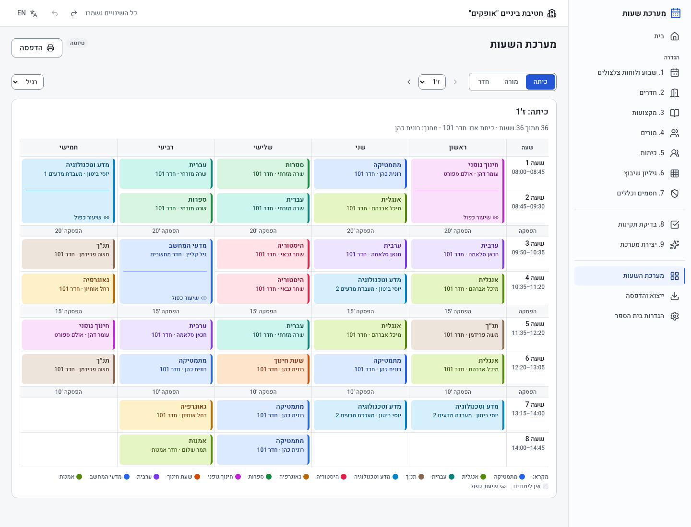

# מערכת שעות · Israeli school timetable builder

A browser-only React + Vite + TypeScript app that builds weekly timetables for Israeli middle
schools (grades 7–9). The UI is in Hebrew (RTL) with an English toggle. All data stays in the browser (localStorage).



## Run

```bash
npm ci
npm run dev        # http://localhost:5173/ (a demo middle school is pre-loaded on first run)
npm test           # vitest (solver, validator, checker, storage, i18n)
npm run lint       # oxlint
npm run typecheck  # tsc -b
npm run build      # production build in dist/; BASE_PATH=/Schedual-builder/ for GitHub Pages
```

## Using it

1. The demo school ("אופקים", 9 classes, 21 teachers, 321 weekly hours) is loaded on first run.
   The Home page can also load the large sample (24 classes).
2. Set up: week and bell schedules → rooms → subjects → teachers → classes → planning sheet
   (class × subject: teacher or **Auto**, hours, doubles) → blocks.
3. **Validate** lists errors, warnings and notes, with a link to the record to fix.
4. **Generate** runs the solver in a Web Worker, with progress and Stop. The result is a draft
   that you can Accept or Discard.
5. **Timetable** shows class, teacher and room views, with doubles and breaks. Print uses the browser.
6. **Export** saves or loads a JSON project file.

## Architecture

```
src/model/     types, defaults, week/bell helpers, samples
src/solver/    validate → assign auto teachers → compile → place (MRV DFS + Luby restarts,
               rooms matched in the same step) → optimise (simulated annealing) → report
src/storage/   KeyValueStore + SchoolRepository (localStorage), project file (schemaVersion 1)
src/worker/    Web Worker wrapper around solveSteps
src/i18n/      he/en resources (generated by scripts/gen_i18n.py; don't edit the JSON)
src/app/       store (undo/redo, autosave), src/pages/ screens, src/components/ UI kit
src/design/    design tokens (tokens.css)
```

See [docs/SOLVER_API.md](docs/SOLVER_API.md) for the solver interface and algorithm, and
[docs/PRODUCT_SPEC.md](docs/PRODUCT_SPEC.md) for the product spec.

## Current limitations

- School switcher and create/delete school are not in the UI yet (the data model supports
  multiple schools).
- No drag-and-drop editing or locking of lessons, and no continuous validation.
- Clusters aren't solved (warning only). Room matching uses short augmenting paths, not a
  full bipartite re-match. The auto-teacher choice isn't revisited during optimisation.
- The UI is a simplified version of design v1.1.
